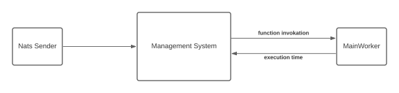

# Stage-2
This folder contains code to meet the new specified [project objectives](https://github.com/gavi210/UZH_ECMASCRIPT_PROJECT/blob/main/project-objectives/README.md).

## Nats Docker Execution
To run NATS server in Docker container: 
```
docker run -p 4222:4222 -ti nats:latest
```

## Security Implication using WebWorkers
As mentioned [here](https://developer.mozilla.org/en-US/docs/Web/API/Web_Workers_API), workers executes under a different global scope.
Therefore, data in the parent workers shouldn't be accessible from the WebWorker. The only way to share data is through message
passing technique. No global objects could be created to impact other WebWorkers.

Nevertheless, ``deno_runtime::permissions::Permissions;`` allows specifying which permissions each WebWorker has. 
The list of all permissions are: ``read, write, net, env, run, ffi, hrtime``. Allowing permissions to WebWorkers may let
to security threats: i.e. ``read, write`` allows modifying files in the same directory as the MainWorker.  

## Performance Comparison (MainWorker vs WebWorker)
### Testing Environment
To compare performances, testing environment has to be set.
The environment is composed by: 
- test function: [web-worker-module.js](nats-receiver/functions/web-worker-module.js),
- runtime comparison value: as observed with a previous performance analysis, MainWorker executes [web-worker-module.js](nats-receiver/functions/web-worker-module.js) in around 1.7 seconds,
- architecture to execute [web-worker-module.js](nats-receiver/functions/web-worker-module.js) in WebWorkers.

#### Testing Architecture
A simple architecture has been proposed to trigger function execution from NATS into WebWorkers.  
The main idea is to instantiate a MainWorker parsing the received NATS messages, and for each message, execute the corresponding function 
in a different WebWorker. 
To allow such triggering, a communication technique between the Rust Management System and the MainWorker has to be developed. 
Furthermore, the MainWorker capabilities has be extended so to instantiate WebWorkers, measure their execution times and send back the performance data.

#### Management System <-> MainWorker Communication
The communications between Management System and MainWorker could be summarized as follows.

[Local Ispector](https://docs.rs/deno_core/0.108.0/deno_core/struct.LocalInspectorSession.html) could be used to exchange messages.

#### WebWorker Execution
The [execute_function()](nats-receiver/src/web_worker_manager.rs) provides an example on how to instantiate WebWorkers.
The [create_web_worker_cb](https://docs.rs/deno_runtime/0.34.0/deno_runtime/ops/worker_host/type.CreateWebWorkerCb.html) dynamic function
has been implemented, and it is invoked every time the main worker instantiates a new worker.

### Function Execution being measured
To run the performance comparison, a simple function is executed.
```
for (var i = 0; i < iterations; i++) {
        ;
    }
```
``iterations`` parameter could be dynamically modified.

### Performance Comparison
Following performance data have been obtained by setting ``iterations = 10000``.

MainWorker: [
74.741553ms,
12.579586ms,
26.552651ms,
15.891756ms,
13.911295ms,
13.475766ms,
13.45593ms,
13.433826ms,
14.139253ms,
13.484625ms
]

WebWorkers: [
30.358123000000003,
24.004389999999994,
18.141260000000003,
16.883055999999996,
17.133387,
15.995173999999992,
17.17697800000002,
17.203782000000018,
27.79907,
21.666500000000013
]

As could be noticed, no significant performance difference could be noticed.

### Outcome Conclusion
As opposite to what the developers had expected, no significant performance difference could be noticed.
After an inspection of the code, emerged that the procedure to instantiate each MainWorker and WebWorker is in ``deno`` implemented the same: 
at every instantiation, a new ``Isolate`` and ``Context`` is loaded. Therefore, since the set-up work for the workers is the same, 
no difference in performance emerged. 
To speed-up function execution in WebWorkers, workers must be reused, so to avoid set-up delays. Further investigation will 
be done in this direction. 

## MainWorker <-> WebWorker Communication
[ops::worker_host](https://docs.rs/deno_runtime/latest/src/deno_runtime/ops/worker_host.rs.html#3-357) implementation specifies
that the only way to communicate with the worker in via ``worker.internal_channel``.

Each WebWorker opens a new ``std::sync::mpsc::Channel``, which is used to communicate with the parent.
An instance of ``std::sync::mpsc::Receiver`` is named ***external handle***, and it is sent back to the parent, so that it is able
to receive messages sent by the child.
An instance of ``std:.sync::mpsc::Sender`` is named ***internal handle***, and it is used by the web worker to send messages over the ``mpsc::Channel``.

